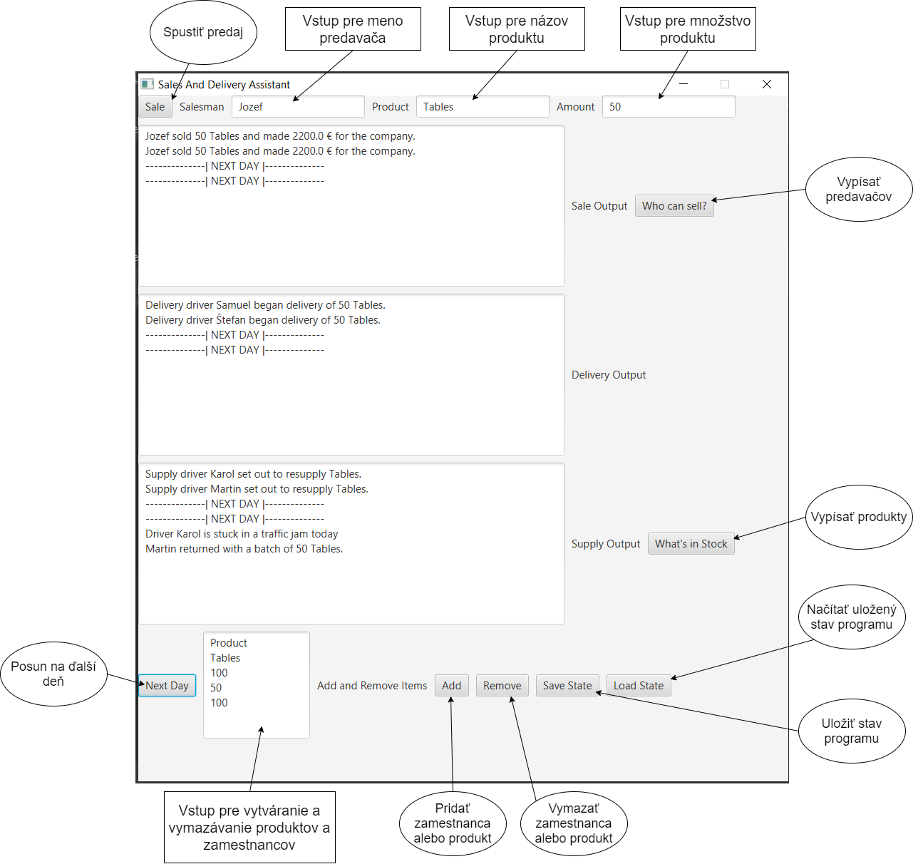
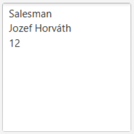
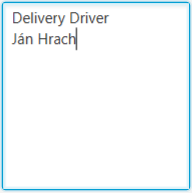
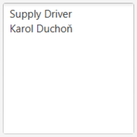
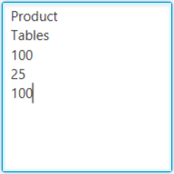
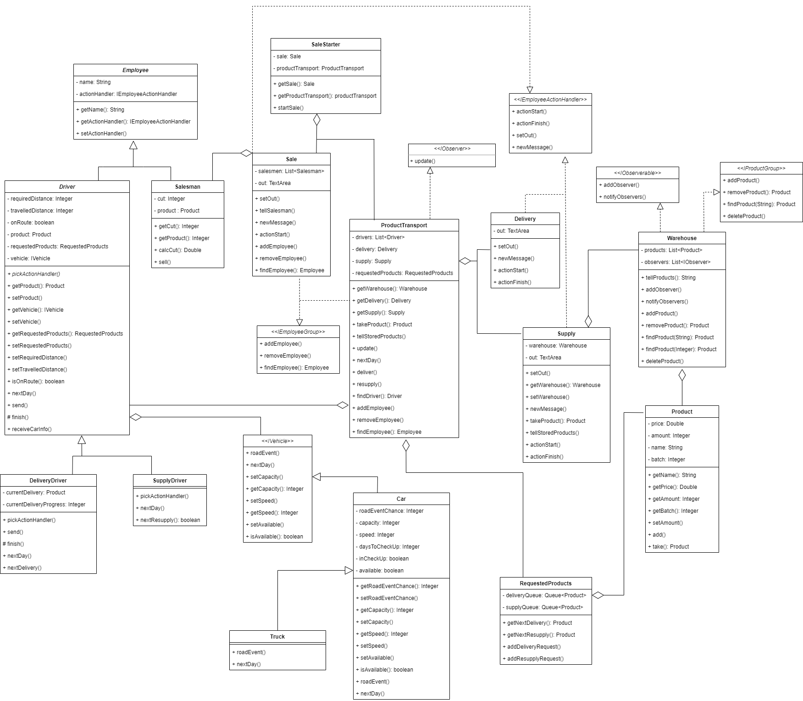

# Sales and Delivery Assistant - SADA

## Oliver Leontiev, ID: 103027

## OOP, 2020
### Opis projektu

SADA je spoľahlivý program, na organizovanie chodu obchodu s produktami (napríklad nábytok, elektronika) a donáškou. Pomáha s manažmentom predavačov, vodičov a skladu. 

Užívateľ môže zadať meno predavača a produktu, ktorý sa podarilo predať. Následne dostane informáciu o zisku z predaja a program nájde voľného kuriéra (delivery driver). Ak voľný nie je žiadny, požiadavka na doručenie produktu sa pridá do rady.  Pokiaľ počet nejakého produktu klesne na nulu, program automaticky doobjedná produkt, podá o tom informáciu a vyšle zásobovacieho vodiča (supply driver).  Kuriér vždy splní celú jednu požiadavku na doručenie sám (ak je produktu veľa, tak na viac krát, pričom informáciu o dokončení podá až nakoniec), aby sa nestalo, že nie je možné doručiť produkt zákazníkovi, kvôli tomu že si niekto objednal toľko produktu, že by obsadil všetkých kuriérov. Zásobovací vodiči si požiadavky rozdelia, aby bol produkt doplnení čo najskôr.

Vodiči majú rôzne vozidlá (auto/kamión), čo ovplyvňuje koľko produktu vedia previesť naraz a akou rýchlosťou. Vozidlá pravidelne podstúpia prehliadku. Produkt je uložený v sklade. 

Užívateľ vie  pridávať či odstraňovať zamestnancov a produkty. Taktiež sa dá stav programu (produkty a zamestnanci) uložiť a načítať pri opätovnom spustení programu. Čo najviac úkonov sa vykoná automaticky a podá sa o nich užívateľovi informácia. 

### Návod na spustenie

Program treba skompilovať a spustiť v Java vývojom prostredí (ideálne IntelliJ). Metóda main() sa nachádza v triede View.java, čiže túto triedu treba spustiť . Verzia JDK je 8 (jdk1.8.0_241).

### Návod na použitie

*Po spustení načítajte predpripravené produkty a zamestnancov stlačením tlačidla "Load State", na zistenie aké produkty a predavači sa dajú následne použiť, stlačte tlačidlá "Who can sell?" a "What's in stock?".*

Po spustení programu sa otvorí hlavné okno, v jeho hornej časti sú tri vstupné polia: "**Salesman**", "**Product**" a "**Amount**". 
Do týchto polí treba zadať kto, čo a koľko predal (viď. obrázok) a potom potvrdiť predaj tlačidlom "**Sale**" vľavo hore. 

Tlačidlo "**Who can sell**?" vypíše predavačov a tlačidlo "**What's in stock**?" vypíše produkty a ich množstvo na sklade (maximálny počet na predaj). Toto slúži ako informácia pre zadávanie vstupu.

**Malé textové pole na spodku** slúži na vstup pre pridávanie a odstraňovanie produktov a zamestnancov. Vstup musí mať správnu formu (uvedené nižšie), a následne po stlačení "**Add**" sa produkt alebo zamestnanec pridá do programu a po stlačení "**Remove**" sa odstráni.

Tlačidlo "**Save State**" uloží stav programu (produkty a zamestnancov) a tlačidlo "**Load State**" načíta posledný uložený stav.

Forma pre **pridávanie a odstraňovanie** (každá položka musí ísť na samostatný riadok ako je uvedené v tomto príklade, na prvom riadku je vždy anglický typ toho, čo pridávame/odstraňujeme):

**Predavač:**

Salesman

Meno

Provízia (celé číslo)

**Vodič:**

Typ vodiča (Delivery Driver alebo Supply Driver)

Meno

**Produkt:**

Product

Názov produktu

Množstvo

Cena

Množstvo, ktoré sa má doplniť keď sa produkt vypredá

Pre **odstránenie** stačí zadať prvé dva riadky (typ a názov/meno existujúceho produktu/vodiča), pričom pre vodiča stačí napísať Driver, ako typ (netreba špecifikovať).

### Čo sa má diať

Prvé veľké textové pole reprezentuje výstup pre predaj - "**Sale Output**" , druhé pre dovoz - "**Delivery Output**" a tretie pre stav skladu a dopĺňanie tovaru - "**Supply Output**". Po predaní nejakého množstva produktu sa vypíše, koľko dotyčný predavač zarobil pre firmu do prvého poľa. 

Následne program vyberie kuriéra (Delivery Driver), ktorý produkt odvezie. Ak nie je nijaký kuriér voľný, tak pridá doručenie do rady. Kuriér prejde vzdialenosť 3 za jeden deň a odvezie maximálne 20 kusov produktu naraz, pričom vzdialenosť ku zákazníkom je 3 (čiže doručí najviac 20 kusov produktu za deň). Keď kuriér vyrazí a dokončí doručenie, vypíše sa to do druhého poľa (ako dokončenie sa počíta dokončenie doručenia celej objednávky). Kuriérovi sa môže stať nehoda (10% šanca), čo znamená že v ten deň nemôže doručovať a zatiaľ sa mu opraví auto (všetko sa vypisuje do druhého poľa).

Ak sa nejaký produkt minie, program vyšle zásobovacieho vodiča (Supply Driver). Tento vodič má vzdialenosť k dodávateľovi 4 a prejde vzdialenosť 2 za deň, pričom má kapacitu vozidla 50 kusov (čiže privezie 50 kusov produktu za 2 dni). Zásobovací vodič môže uviaznuť v zápche (20% šanca) a vtedy sa jeho rýchlosť zníži z 2 na 1 na jeden deň. Každá požiadavka na zásobovanie sa rozdelí medzi zásobovacích vodičov, kým sa nerozdelí celá alebo už nie sú voľní vodiči. Ak nie sú voľní vodiči požiadavka sa odloží do rady.  Koľko produktu sa má priviesť je informácia, ktorú si uchováva o sebe každý produkt. Výpisy a ostatné správanie je podobné kuriérovi. 

Každé vozidlo musí podstúpiť pravidelnú prehliadku každých 5 dní. Oprava auta sa ráta ako prehliadka.
Tlačidlo "**Next Day**" dá signál programu, že ubehol deň. Program vypíše, čo nové sa za ten deň stalo.

### Splnenie hlavných kritérií

#### Dedenie

Dve oddelené hierarchie sú:  

1. Employee, Salesman, Driver, DeliveryDriver, SupplyDriver.
2. IVehicle, Car, Truck.

#### Polymorfizmus

V triedach DeliveryDriver a SupplyDriver je prekonaná metóda nextDay().

https://github.com/OOP-FIIT/oop-2020-uto-18-c-kovacik-revilO602/blob/229c1b73ce4c6ef659a441ff54d0ca1948986faa/src/model/employees/drivers/DeliveryDriver.java#L74-L82
https://github.com/OOP-FIIT/oop-2020-uto-18-c-kovacik-revilO602/blob/229c1b73ce4c6ef659a441ff54d0ca1948986faa/src/model/employees/drivers/SupplyDriver.java#L37-L45

Túto metódu volá nad všetkými Drivermi trieda ProductTransport.

https://github.com/OOP-FIIT/oop-2020-uto-18-c-kovacik-revilO602/blob/229c1b73ce4c6ef659a441ff54d0ca1948986faa/src/model/ProductTransport.java#L94-L100

V triede DeliveryDriver je prekonaná metóda finish().

https://github.com/OOP-FIIT/oop-2020-uto-18-c-kovacik-revilO602/blob/229c1b73ce4c6ef659a441ff54d0ca1948986faa/src/model/employees/drivers/DeliveryDriver.java#L56-L72

Túto metódu volá nadtrieda Driver sama nad sebou.

https://github.com/OOP-FIIT/oop-2020-uto-18-c-kovacik-revilO602/blob/229c1b73ce4c6ef659a441ff54d0ca1948986faa/src/model/employees/drivers/Driver.java#L129-L137

V triede Truck sú prekonané metódy nextDay() a roadEvent().

https://github.com/OOP-FIIT/oop-2020-uto-18-c-kovacik-revilO602/blob/229c1b73ce4c6ef659a441ff54d0ca1948986faa/src/model/vehicles/Truck.java#L25-L55

nextDay() je volaná nad rozhraním IVehicle v triede Driver.

https://github.com/OOP-FIIT/oop-2020-uto-18-c-kovacik-revilO602/blob/229c1b73ce4c6ef659a441ff54d0ca1948986faa/src/model/employees/drivers/Driver.java#L130

roadEvent() volá nadtrieda Car sama nad sebou.

https://github.com/OOP-FIIT/oop-2020-uto-18-c-kovacik-revilO602/blob/229c1b73ce4c6ef659a441ff54d0ca1948986faa/src/model/vehicles/Car.java#L137

#### Agregácia

Trieda Warehouse agreguje všetky produkty v ArrayListe.

https://github.com/OOP-FIIT/oop-2020-uto-18-c-kovacik-revilO602/blob/229c1b73ce4c6ef659a441ff54d0ca1948986faa/src/model/storage/Warehouse.java#L15

Trieda SaleStarter agreguje Sale a ProductTransport.

https://github.com/OOP-FIIT/oop-2020-uto-18-c-kovacik-revilO602/blob/229c1b73ce4c6ef659a441ff54d0ca1948986faa/src/model/SaleStarter.java#L19-L20

Trieda ProductTransport agreguje všetkých Driverov, Supply, Delivery a RequestedProducts.

https://github.com/OOP-FIIT/oop-2020-uto-18-c-kovacik-revilO602/blob/229c1b73ce4c6ef659a441ff54d0ca1948986faa/src/model/ProductTransport.java#L24-L27

Trieda Sale agreguje Salesman.

https://github.com/OOP-FIIT/oop-2020-uto-18-c-kovacik-revilO602/blob/229c1b73ce4c6ef659a441ff54d0ca1948986faa/src/model/employeeActionHandlers/Sale.java#L19

Trieda Driver agreguje IVehicle.

https://github.com/OOP-FIIT/oop-2020-uto-18-c-kovacik-revilO602/blob/229c1b73ce4c6ef659a441ff54d0ca1948986faa/src/model/employees/drivers/Driver.java#L23

#### Enkapsulácia

Všetky atribúty sú private, s využitím get a set metód. Názorná ukážka na triede Product.
https://github.com/OOP-FIIT/oop-2020-uto-18-c-kovacik-revilO602/blob/229c1b73ce4c6ef659a441ff54d0ca1948986faa/src/model/storage/Product.java#L11-L14

#### Oddelenie GUI od aplikačnej logiky

Na toto oddelenie bol použitý návrhový vzor MVC (triedy View, Controller a balík model).

### Splnenie vedľajších kritérií

#### Návrhové vzory

Na oddelenie aplikačnej logiky od GUI bol použitý návrhový vzor MVC (triedy View, Controller a balík model).

V programe je použitý návrhový vzor Observer (rozhrania IObserver a IObservable), ktorý slúži na to aby Warehouse (Observable) aktualizoval ProductTransport (Observer) s informáciou o vypredaní produktu.

https://github.com/OOP-FIIT/oop-2020-uto-18-c-kovacik-revilO602/blob/229c1b73ce4c6ef659a441ff54d0ca1948986faa/src/model/storage/Warehouse.java#L92-L95
https://github.com/OOP-FIIT/oop-2020-uto-18-c-kovacik-revilO602/blob/229c1b73ce4c6ef659a441ff54d0ca1948986faa/src/model/ProductTransport.java#L88-L92

#### Vlastné výnimky

V programe sú použité vlastné výnimky EmployeeAlreadyExistsException, SellingBelowOneException, WrongProductInputException a WrongSalesmanNameException. Vyhodenie výnimky je ošetrené vytvorením poplašného okna so správou pre užívateľa.

Prvá je vyhadzovaná pokiaľ sa užívateľ pokúša pridať do programu predavača s rovnakým menom ako predavač, ktorý už existuje.

https://github.com/OOP-FIIT/oop-2020-uto-18-c-kovacik-revilO602/blob/229c1b73ce4c6ef659a441ff54d0ca1948986faa/src/model/objectManagment/ObjectCreator.java#L83

Ostatné sú vyhadzované pri nesprávnom vstupe pre predaj produktu.

https://github.com/OOP-FIIT/oop-2020-uto-18-c-kovacik-revilO602/blob/229c1b73ce4c6ef659a441ff54d0ca1948986faa/src/model/SaleStarter.java#L54-L58
https://github.com/OOP-FIIT/oop-2020-uto-18-c-kovacik-revilO602/blob/229c1b73ce4c6ef659a441ff54d0ca1948986faa/src/Controller.java#L42

#### GUI

GUI je vytvorené v triede View. Skladá sa len z hlavného okna a s modelom je prepojené cez triedu Controller.

#### Explicitné využitie RTTI

RTTI je využité na nájdenie správneho typu vodiča v triede ProductTransport.

https://github.com/OOP-FIIT/oop-2020-uto-18-c-kovacik-revilO602/blob/229c1b73ce4c6ef659a441ff54d0ca1948986faa/src/model/ProductTransport.java#L141-L154

#### Použitie vhniezdených tried

Vhniezdené triedy sú použité v triede View na vytvorenie handlerov pre tlačidlá.

https://github.com/OOP-FIIT/oop-2020-uto-18-c-kovacik-revilO602/blob/229c1b73ce4c6ef659a441ff54d0ca1948986faa/src/View.java#L67-L82

#### Použitie lambda výrazov

Lambda výrazy sú použité v triede View, ako handlery pre tlačidlá.

https://github.com/OOP-FIIT/oop-2020-uto-18-c-kovacik-revilO602/blob/229c1b73ce4c6ef659a441ff54d0ca1948986faa/src/View.java#L230

#### Použitie implicitnej implementácie metód v rozhraniach

Použité v rozhraní IEmployeeActionHandler pri metóde actionFinish(). V prípade, že zamestnanec vykoná akciu instantne, tak aby nemusel implementovať túto metódu, tak má predvolené telo, ktoré volá metódu actionStart().

https://github.com/OOP-FIIT/oop-2020-uto-18-c-kovacik-revilO602/blob/229c1b73ce4c6ef659a441ff54d0ca1948986faa/src/model/employeeActionHandlers/IEmployeeActionHandler.java#L20-L29

#### Použitie serializácie

Trieda SaleStarter nepriamo agreguje objekty, ktoré sa dajú uložiť a načítať (produkty a zamestnanci). Objekt triedy SaleStarter sa serializuje do súboru *Data.txt*. Serializáciu spravuje trieda Serializer.

https://github.com/OOP-FIIT/oop-2020-uto-18-c-kovacik-revilO602/blob/229c1b73ce4c6ef659a441ff54d0ca1948986faa/src/model/objectManagment/Serializer.java#L25-L57

### UML Class Diagram

Triedy View, Controller, triedy v balíku objectManagment a výnimky boli vynechané.

### Hlavné verzie programu

1. Vytvorenie tried Employee, Salesman (dedí Employee), Product a Warehouse (agreguje Product), s tým že Salesman vie predať Product z Warehouse.

2. Vytvorenie tried Driver (dedí Employee) a Delivery Driver (dedí Driver), Delivery Driver má vnorenú triedu Rating.

3. Vytvorenie tried Sale a Delivery (agregujú Salesman a Delivery Driver v array listoch); vytvorená prvá verzia GUI (hlavné okno); vytvorenie triedy SADA, ktorá agreguje Sale a Delivery. Delivery Driver doručí Product po predaji.

4. Vytvorenie tried Supply a Supply Driver (dedí Driver), pridaný návrhový vzor Observer (IObserver a IObservable), warehouse implementuje IObservable a Supply implementuje IObserver, keď sa vypredá Product, Supply Driver ho pôjde priviesť. 

5. Pridaná funkcionalita na posunutie dňa a tlačidlo Next Day. Nová verzia GUI (rozdelené výstupy).

6. Každý Driver si drží rad požiadaviek, trieda rating odstránená z Delivery Driver, pridaná metóda trafficJam() do SupplyDriver.

7. Pridaná trieda ProductTransport (agreguje všetkých vodičov, Supply a Delivery), ktorá nahrádza triedu SADA (tá je vymazaná); Supply a Delivery už neagregujú vodičov. 
8. Pridaná trieda SaleStarter, ktorá začne predaj a kontroluje vstup; pridané vlastné výnimky; Driver má už len jeden produkt, ktorý práve preváža; rad požiadaviek na transport produktu je v novej triede RequestedProducts.
9. Pridaný Controller a MainWindow premenované na View (MVC); pridané triedy na tvorbu, mazanie a serializovanie objektov (ObjectCreator, ObjectDeleter, Serializer) a pridaná serializácia; pridané GUI elementy pre vytváranie, mazanie, uloženie a načítanie objektov; pridané rozhrania IEmployeeGroup, IProductGroup a IEmployeeActionHandler.
10. Pridané vozidlá pre vodičov (IVehicle, Car, Truck) a časť funkcionality premiestnená do nich (trafficJam(), accident()) + nová funkcionalita (pravidelné kontroly, rýchlosť); pridaný javadoc. 

